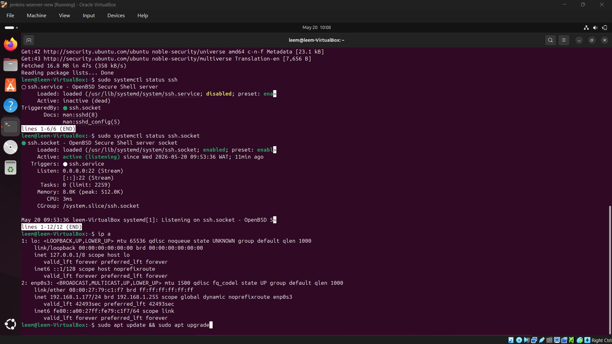
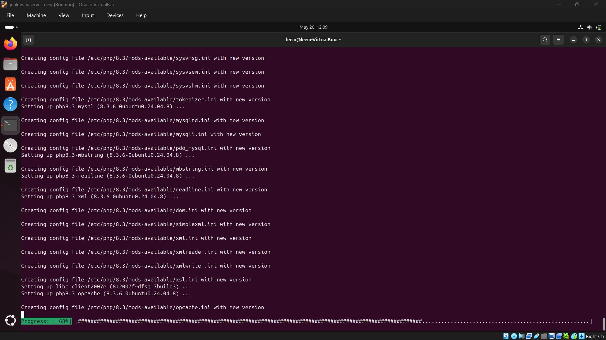
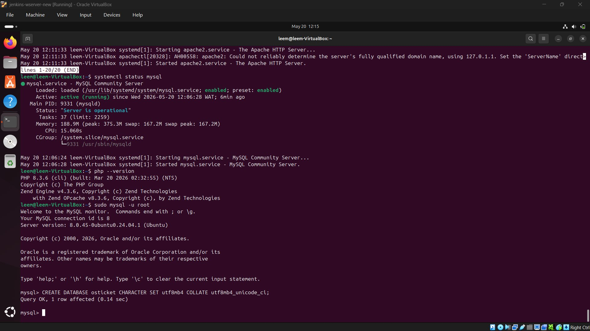
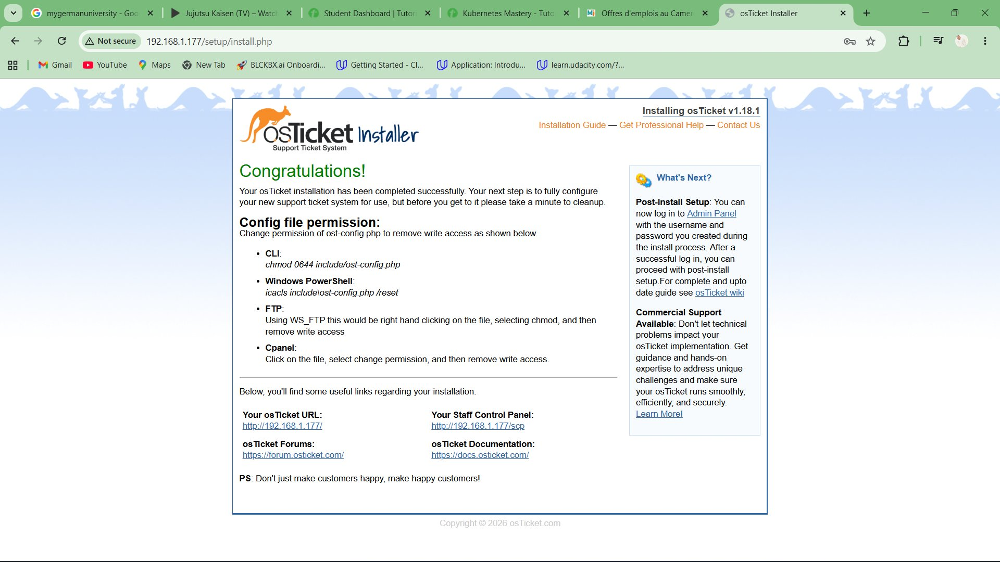
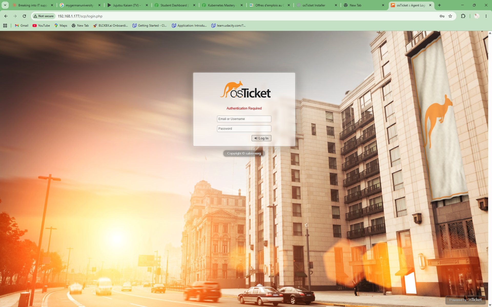
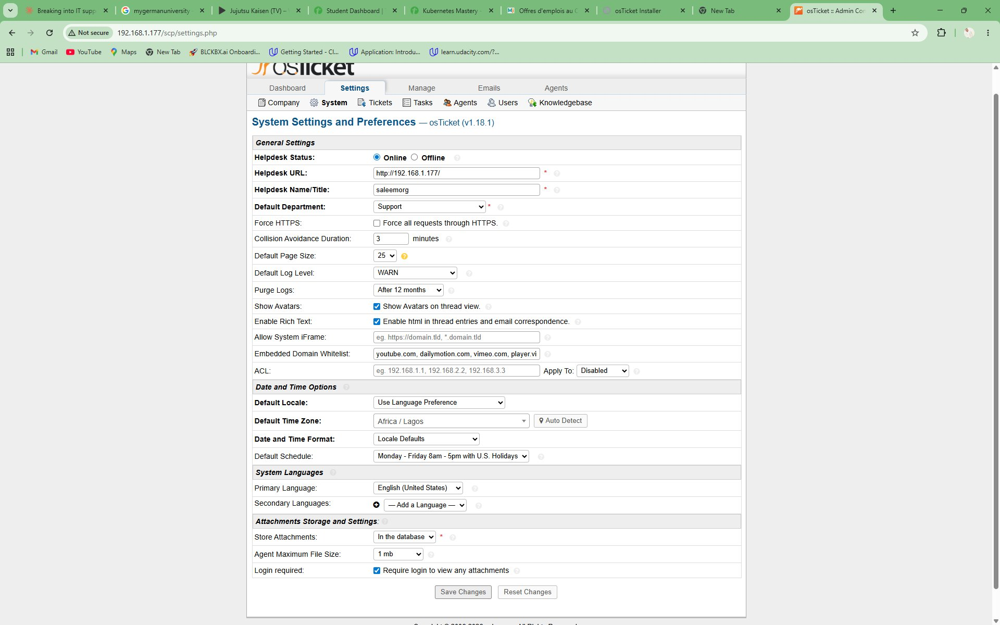
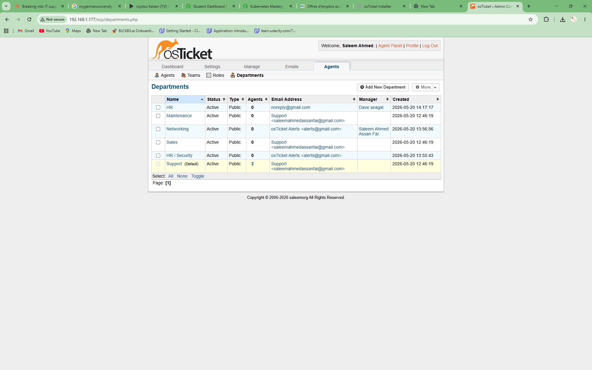
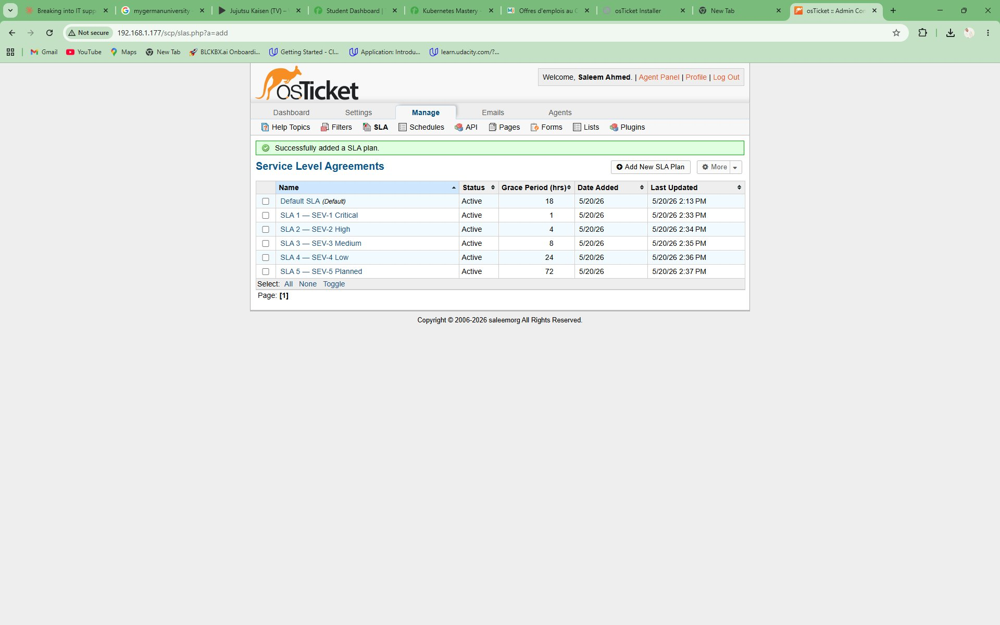
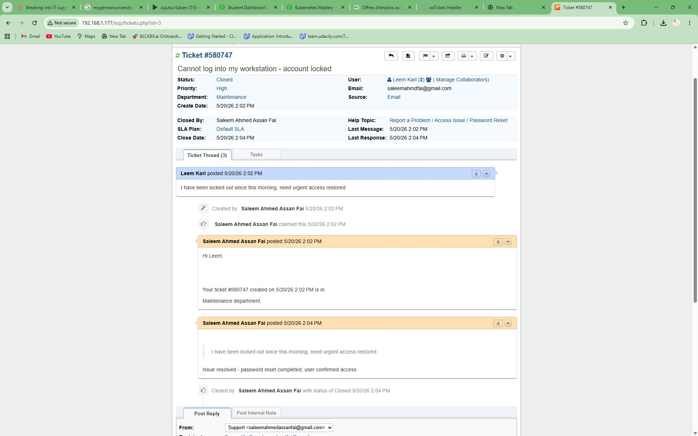
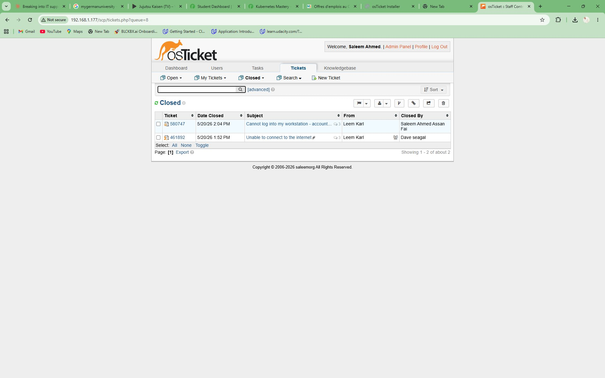

# 🎫 osTicket Help Desk Lab

> A fully functional IT help desk environment built from scratch on a Linux virtual machine — simulating real-world L1 support operations including ticket triage, SLA management, escalation workflows, and resolution documentation.

---

## 📋 Table of Contents

- [Project Overview](#project-overview)
- [Skills Demonstrated](#skills-demonstrated)
- [Lab Architecture](#lab-architecture)
- [Requirements](#requirements)
- [Environment Setup](#environment-setup)
  - [Step 1 — Install VirtualBox and Create Ubuntu VM](#step-1--install-virtualbox-and-create-ubuntu-vm)
  - [Step 2 — Connect via SSH](#step-2--connect-via-ssh)
  - [Step 3 — Install the LAMP Stack](#step-3--install-the-lamp-stack)
  - [Step 4 — Create MySQL Database and User](#step-4--create-mysql-database-and-user)
  - [Step 5 — Download and Deploy osTicket](#step-5--download-and-deploy-osticket)
  - [Step 6 — Configure Apache Virtual Host](#step-6--configure-apache-virtual-host)
  - [Step 7 — Run the Web Installer](#step-7--run-the-web-installer)
  - [Step 8 — Post-Install Cleanup](#step-8--post-install-cleanup)
- [osTicket Configuration](#osticket-configuration)
  - [System Settings](#system-settings)
  - [Departments](#departments)
  - [SLA Plans](#sla-plans)
  - [Help Topics](#help-topics)
  - [Agent Accounts](#agent-accounts)
- [Ticket Lifecycle Walkthrough](#ticket-lifecycle-walkthrough)
  - [Creating a Ticket](#creating-a-ticket-end-user)
  - [Working a Ticket](#working-a-ticket-agent)
  - [Resolving and Closing a Ticket](#resolving-and-closing-a-ticket)
- [Sample Tickets Created](#sample-tickets-created)
- [Key Concepts Practised](#key-concepts-practised)
- [Troubleshooting Notes](#troubleshooting-notes)
- [What I Learned](#what-i-learned)

---

## Project Overview

This lab simulates a corporate IT help desk environment using **osTicket v1.18.1** — an open-source ticketing platform used by real support teams worldwide. The goal was to build hands-on experience with the tools, workflows, and documentation practices used in L1/L2 IT support roles before entering the job market.

The lab was built entirely from scratch on a local virtual machine, documenting every command and configuration decision along the way.

**Access URLs (local lab environment):**

| Portal | URL | Purpose |
|--------|-----|---------|
| End User Portal | `http://192.168.1.177` | Submit support tickets |
| Staff Control Panel | `http://192.168.1.177/scp` | Manage, work, and close tickets |

---

## Skills Demonstrated

- Linux server administration (Ubuntu 22.04)
- LAMP stack installation and configuration (Apache, MySQL, PHP)
- Web application deployment on a Linux server
- MySQL database creation and user permission management
- Apache virtual host configuration
- SSH remote server access and management
- IT help desk operations — ticket triage, SLA management, escalation
- Support ticket documentation and resolution writing
- IT service management (ITSM) concepts

---

## Lab Architecture

```
┌─────────────────────────────────────────────────────┐
│                  Host Machine (Windows)              │
│                                                     │
│   Browser ──────────────── SSH Terminal             │
│      │                          │                   │
│      │ http://192.168.1.177     │ ssh leem@192.168.1.177
│      │                          │                   │
└──────┼──────────────────────────┼───────────────────┘
       │                          │
       ▼                          ▼
┌─────────────────────────────────────────────────────┐
│           Ubuntu 22.04 VM (VirtualBox)               │
│                IP: 192.168.1.177                    │
│                                                     │
│  ┌──────────┐  ┌──────────┐  ┌────────────────┐    │
│  │  Apache  │  │  PHP 8.3 │  │  MySQL 8.0     │    │
│  │  :80     │  │          │  │  osticket DB   │    │
│  └──────────┘  └──────────┘  └────────────────┘    │
│                                                     │
│  ┌─────────────────────────────────────────────┐   │
│  │           osTicket v1.18.1                  │   │
│  │   /var/www/osticket/upload/                 │   │
│  └─────────────────────────────────────────────┘   │
└─────────────────────────────────────────────────────┘
```

---

## Requirements

### Hardware (Host Machine)
| Component | Minimum | Used in This Lab |
|-----------|---------|-----------------|
| RAM | 4 GB | 8 GB host / 1536 MB VM |
| Disk Space | 25 GB free | 16.65 GB VM disk |
| OS | Windows 10/11, macOS, Linux | Windows 11 |

### Virtual Machine Specs
| Component | Value |
|-----------|-------|
| RAM allocated | 1536 MB |
| Disk | 16.65 GB (dynamically allocated VDI) |
| CPUs | 2 |
| OS | Ubuntu 22.04 LTS (64-bit) |
| Network | Bridged Adapter |

### Software Downloads

| Software | Version | Download Link |
|----------|---------|---------------|
| Oracle VirtualBox | 7.x (latest) | https://www.virtualbox.org/wiki/Downloads |
| Ubuntu Server | 22.04 LTS | https://ubuntu.com/download/server |
| osTicket | v1.18.1 | https://github.com/osTicket/osTicket/releases |

> All software used in this lab is free and open-source. No licences or subscriptions required.

---

## Environment Setup

### Step 1 — Install VirtualBox and Create Ubuntu VM

1. Download and install **VirtualBox** from virtualbox.org
2. Download the **Ubuntu 22.04 LTS Server ISO**
3. In VirtualBox, click **New** and configure:

```
Name:             osTicket-Lab
Type:             Linux
Version:          Ubuntu (64-bit)
Base Memory:      1536 MB
Processors:       2
Hard Disk:        Create new VDI, dynamically allocated, 20 GB
```

4. Go to **Settings → Storage** → mount the Ubuntu ISO to the optical drive
5. Go to **Settings → Network** → set Adapter 1 to **Bridged Adapter**
6. Start the VM and complete the Ubuntu Server installation
7. When prompted during install, **enable OpenSSH server**

---

### Step 2 — Connect via SSH

After the VM boots, verify SSH is available:

```bash
# Check SSH socket status
sudo systemctl status ssh.socket
```

Expected output — confirms SSH is ready to accept connections:
```
● ssh.socket - OpenBSD Secure Shell server socket
     Active: active (listening)
     Listen: 0.0.0.0:22 (Stream)
```

> **Note:** Ubuntu 22.04 uses socket-based SSH activation. `ssh.service` will show as inactive — this is normal. The socket being `active (listening)` is all that matters.

Get the VM's IP address:

```bash
ip a
```

Look for `inet 192.168.x.x` under `enp0s3`. Then connect from Windows PowerShell on the host:

```bash
ssh leem@192.168.1.177
```

**Screenshot — SSH verified, IP confirmed at 192.168.1.177, system update initiated:**



> All subsequent commands were run over SSH from the host machine, allowing commands to be pasted directly rather than typed inside the VirtualBox window.

---

### Step 3 — Install the LAMP Stack

LAMP (Linux, Apache, MySQL, PHP) is the foundation osTicket runs on.

```bash
# Update package lists and upgrade existing packages
sudo apt update && sudo apt upgrade -y

# Install Apache web server
sudo apt install apache2 -y

# Install MySQL database server
sudo apt install mysql-server -y

# Install PHP 8.x and all extensions required by osTicket
sudo apt install php php-mysqli php-gd php-xml php-mbstring \
  php-imap php-intl php-apcu php-ctype php-json \
  libapache2-mod-php -y

# Enable Apache URL rewrite module (required for osTicket clean URLs)
sudo a2enmod rewrite

# Restart Apache to apply changes
sudo systemctl restart apache2
```

**Screenshot — PHP 8.3 and all required extensions installing successfully:**



Verify all services are running:

```bash
systemctl status apache2    # Expected: active (running)
systemctl status mysql      # Expected: active (running)
php --version               # Expected: PHP 8.3.x
```

---

### Step 4 — Create MySQL Database and User

osTicket requires its own dedicated database with a MySQL user scoped to that database only — following the principle of least privilege.

```bash
# Open MySQL shell as root
sudo mysql -u root
```

Inside the MySQL shell:

```sql
-- Create the osTicket database with proper UTF-8 encoding
CREATE DATABASE osticket CHARACTER SET utf8mb4 COLLATE utf8mb4_unicode_ci;

-- Create a dedicated database user
CREATE USER 'osticket_user'@'localhost' IDENTIFIED BY 'StrongPass123!';

-- Grant the user access to only the osticket database
GRANT ALL PRIVILEGES ON osticket.* TO 'osticket_user'@'localhost';

-- Apply the privilege changes
FLUSH PRIVILEGES;
EXIT;
```

**Screenshot — MySQL 8.0 running and confirmed operational, PHP 8.3.6 verified, database created:**



Verify credentials work before continuing:

```bash
mysql -u osticket_user -p osticket
# Enter password — reaching the mysql> prompt confirms credentials are correct
# Type: exit
```

---

### Step 5 — Download and Deploy osTicket

```bash
# Navigate to temp directory
cd /tmp

# Download osTicket v1.18.1 release
wget https://github.com/osTicket/osTicket/releases/download/v1.18.1/osTicket-v1.18.1.zip

# Install unzip utility
sudo apt install unzip -y

# Extract to the Apache web root
sudo unzip osTicket-v1.18.1.zip -d /var/www/osticket

# Copy the sample config to create the live config file
sudo cp /var/www/osticket/upload/include/ost-sampleconfig.php \
        /var/www/osticket/upload/include/ost-config.php

# Set Apache as the owner of all osTicket files
sudo chown -R www-data:www-data /var/www/osticket

# Temporarily allow the installer to write to the config file
sudo chmod 0666 /var/www/osticket/upload/include/ost-config.php
```

---

### Step 6 — Configure Apache Virtual Host

Create a dedicated Apache configuration file for osTicket:

```bash
sudo nano /etc/apache2/sites-available/osticket.conf
```

Paste the following configuration:

```apache
<VirtualHost *:80>
    ServerAdmin admin@lab.local
    DocumentRoot /var/www/osticket/upload
    ServerName osticket.lab.local

    <Directory /var/www/osticket/upload>
        Options FollowSymLinks
        AllowOverride All
        Require all granted
    </Directory>

    ErrorLog ${APACHE_LOG_DIR}/osticket_error.log
    CustomLog ${APACHE_LOG_DIR}/osticket_access.log combined
</VirtualHost>
```

Enable the new site and disable the default:

```bash
# Enable the osTicket virtual host
sudo a2ensite osticket.conf

# Disable the default Apache placeholder site
sudo a2dissite 000-default.conf

# Reload Apache to apply the new configuration
sudo systemctl reload apache2
```

---

### Step 7 — Run the Web Installer

Navigate to `http://192.168.1.177/setup` in a browser on the host machine.

**Screenshot — osTicket web installer loaded and ready for configuration:**


Fill in the installer form:

**System Settings:**
| Field | Value |
|-------|-------|
| Helpdesk Name | saleemorg |
| Default Email | admin@lab.local |

**Database Settings:**
| Field | Value |
|-------|-------|
| MySQL Table Prefix | `ost_` (leave as default) |
| MySQL Hostname | `localhost` |
| MySQL Database | `osticket` |
| MySQL Username | `osticket_user` |
| MySQL Password | *(password set in Step 4)* |

Click **Install Now**.

**Screenshot — Installation completed successfully:**



---

### Step 8 — Post-Install Cleanup

These two commands are mandatory immediately after installation:

```bash
# Lock the config file — remove write access now that install is complete
sudo chmod 0644 /var/www/osticket/upload/include/ost-config.php

# Delete the setup directory — prevents anyone from re-running the installer
sudo rm -rf /var/www/osticket/upload/setup
```

> **Security note:** Leaving the `/setup` directory in place is a known vulnerability. Always remove it immediately after installation.

**Screenshot — Staff Control Panel login page confirming osTicket is fully operational:**



Log into the Staff Control Panel at `http://192.168.1.177/scp` using the admin credentials created during installation.

---

## osTicket Configuration

### System Settings

After logging in, navigate to **Admin Panel → Settings → System** to configure the helpdesk identity and behaviour.

**Screenshot — System Settings configured with helpdesk name, timezone (Africa/Lagos), and schedule:**



Key settings configured:
- Helpdesk Name: `saleemorg`
- Default Time Zone: `Africa/Lagos`
- Default Schedule: `Monday–Friday 8am–5pm`
- Attachments: stored in database, 1 MB max file size

---

### Departments

Navigate to: **Admin Panel → Agents → Departments → Add New Department**

**Screenshot — Six departments created and active:**



| Department | Manager | Purpose |
|------------|---------|---------|
| HR | Dave Seagal | HR-related access and account requests |
| Maintenance | — | Facilities and hardware issues |
| Networking | Saleem Ahmed | VPN, connectivity, network access |
| Sales | — | Sales tools and CRM support |
| HR / Security | — | Security incidents and access control |
| Support *(Default)* | Saleem Ahmed | General L1 support queue |

---

### SLA Plans

Navigate to: **Admin Panel → Manage → SLA → Add New SLA Plan**

**Screenshot — Five SLA plans configured covering all ticket severity levels:**



| SLA Plan | Grace Period | Schedule | Use Case |
|----------|-------------|----------|----------|
| SLA 1 — SEV-1 Critical | **1 hour** | 24/7 | Full outage, system down, security breach |
| SLA 2 — SEV-2 High | **4 hours** | 24/7 | User completely locked out, email down |
| SLA 3 — SEV-3 Medium | **8 hours** | Mon–Fri | Software issue with workaround available |
| SLA 4 — SEV-4 Low | **24 hours** | Mon–Fri | Password reset, software install requests |
| SLA 5 — SEV-5 Planned | **72 hours** | Mon–Fri | New equipment, onboarding, non-urgent work |

> **Key concept:** SLA severity is determined by **business impact**, not by how urgent the user says it is. A warehouse unable to print shipping labels during peak hours is SEV-2 even if the user submits it as a standard request — the agent's job is to triage correctly.

---

### Help Topics

Navigate to: **Admin Panel → Manage → Help Topics → Add New Help Topic**

Help topics configured in this lab:
- Password Reset
- Software Installation Request
- VPN Issue
- Printer Offline
- Account Locked
- Network Access Request
- Hardware Fault
- New Employee Setup
- Report a Problem / Access Issue / Password Reset

---

### Agent Accounts

Navigate to: **Admin Panel → Agents → Add New Agent**

| Agent | Role | Department |
|-------|------|------------|
| Saleem Ahmed Assan Fai | Admin / L1 Tech | Support (Default) |
| Dave Seagal | L2 Tech | HR / Networking |

---

## Ticket Lifecycle Walkthrough

### Creating a Ticket (End User)

1. Navigate to `http://192.168.1.177`
2. Click **Open a New Ticket**
3. Fill in contact details, select a **Help Topic**, and describe the issue
4. Click **Create Ticket** — a confirmation with ticket number is returned to the user

---

### Working a Ticket (Agent)

1. Log into `http://192.168.1.177/scp`
2. Click any ticket in the queue to open it
3. Available actions inside a ticket:
   - **Post Reply** — communicate with the end user
   - **Post Internal Note** — document troubleshooting steps (staff-only visibility)
   - **Assign** to a department or specific agent
   - **Set Priority** — Low / Normal / High / Critical
   - **Change SLA Plan** based on business impact assessment
   - **Transfer** to another department if escalation is needed

**Internal note format used in this lab:**

```
Triaged: [Brief description of the reported issue]
Steps taken:
  1. [First action taken]
  2. [Second action taken]
  3. [Third action taken]
Resolution: [What fixed the issue and when confirmed resolved]
Escalated: Yes / No — [reason if escalated]
Time to resolve: [X minutes / hours]
```

---

### Resolving and Closing a Ticket

1. Inside the ticket, scroll to the reply box at the bottom
2. Change the **Ticket Status** dropdown from `Open` → `Resolved`
3. Write a plain-language closing message to the user
4. Click **Post Reply** — ticket moves to the Closed queue automatically

**Screenshot — Ticket #580747 resolved: "Cannot log into my workstation — account locked"**



This ticket shows the full lifecycle:
- User submitted: *"I have been locked out since this morning, need urgent access restored"*
- Agent claimed the ticket immediately
- Agent replied to acknowledge and set expectations
- Issue resolved: password reset completed, user confirmed access
- Ticket closed by agent at 2:04 PM — 2 minutes after creation (within SEV-2 SLA)

**Screenshot — Closed tickets queue showing resolved tickets with agent assignments:**



Closed tickets are accessible under: **Tickets → Closed**

---

## Sample Tickets Created

Ten realistic tickets were created and resolved to simulate a full working day of L1 support:

| # | Issue Reported | Priority | SLA | Resolution Summary |
|---|---------------|----------|-----|-------------------|
| 1 | Cannot log into workstation — account locked | High | SEV-2 High | Unlocked account, reset password, user confirmed access |
| 2 | Unable to connect to the internet | High | SEV-2 High | Identified NIC driver issue, updated driver, connectivity restored |
| 3 | Microsoft Office installation request | Normal | SEV-4 Low | Deployed via software centre, confirmed working |
| 4 | VPN disconnects every 10 minutes | High | SEV-2 High | Identified MTU mismatch, adjusted client network settings |
| 5 | Printer on 3rd floor shows offline | Normal | SEV-3 Medium | Restarted print spooler service, printer back online |
| 6 | Computer running very slowly | Normal | SEV-3 Medium | Found excessive startup processes, cleaned and optimised |
| 7 | New employee needs domain account | Normal | SEV-4 Low | Created account, assigned to correct department and group |
| 8 | Shared drive G: not mapping on startup | Normal | SEV-3 Medium | Fixed drive mapping policy, confirmed on reboot |
| 9 | Screen randomly going black | Normal | SEV-3 Medium | Updated display driver, issue resolved |
| 10 | Software licence expired | Normal | SEV-4 Low | Contacted vendor portal, applied new licence key |

---

## Key Concepts Practised

**Triage** — Assessing incoming tickets and assigning the correct priority and SLA before beginning work. Not all tickets carry equal urgency — a locked account blocking a user mid-shift takes priority over a software install request regardless of submission order.

**Escalation** — Knowing when an issue exceeds L1 scope and needs to be transferred to L2 or a specialist team. Escalation was simulated in this lab by reassigning tickets between agents with full handover documentation.

**SLA Awareness** — Monitoring ticket age relative to SLA deadlines. A SEV-1 Critical ticket with 15 minutes remaining before breach takes priority over all other work regardless of queue order.

**Internal Documentation** — Writing internal notes structured so that any technician could pick up a ticket cold and continue without needing to ask questions. This is a professional standard in every help desk environment.

**End User Communication** — Replying in plain, non-technical language. The resolution message the end user receives should confirm what was done and include any follow-up action required on their part.

**Least Privilege** — Creating the MySQL database user with permissions scoped only to the osticket database, not global access. This principle applies equally to user accounts in Active Directory environments.

---

## Troubleshooting Notes

Real issues encountered during the lab build and how they were resolved:

**Apache ServerName warning on restart**
Apache logged `AH00558: Could not reliably determine the server's fully qualified domain name`. This is a cosmetic warning, not an error — Apache started successfully. Suppressed by adding `ServerName localhost` to `/etc/apache2/apache2.conf`.

**SSH showing as inactive (dead)**
Ubuntu 22.04 uses socket-based SSH activation by default. `ssh.service` showed as `inactive (dead)` but `ssh.socket` was `active (listening)` on port 22. SSH connections worked correctly — this is expected default behaviour, not a fault.

**Jenkins co-existing on the same VM**
Jenkins was already installed on this VM and runs on port 8080. No conflict with osTicket running on port 80. Jenkins was stopped during the lab to conserve RAM on an 8 GB host machine:

```bash
sudo systemctl stop jenkins
sudo systemctl disable jenkins
# Re-enable later with: sudo systemctl enable jenkins --now
```

**MySQL root authentication method**
Ubuntu's default MySQL uses `auth_socket` for the root user — `sudo mysql -u root` is required rather than `mysql -u root -p`. The dedicated `osticket_user` account uses standard password authentication and connects normally.

---

## What I Learned

Building this lab from scratch gave me practical experience that goes beyond what any certification alone covers:

- How a LAMP stack fits together and how each component depends on the others
- Why file permissions matter in a production web context — the `chmod 0666` during install vs `0644` post-install is a deliberate security practice, not arbitrary
- How enterprise ticketing systems structure the relationship between end users, agents, departments, and SLA commitments
- The importance of writing internal notes that are genuinely useful to a colleague picking up the ticket cold
- How to troubleshoot a live server environment methodically — reading service status output, checking logs, isolating the failure layer
- That real IT support is as much about communication and documentation as it is about technical resolution
- SLA severity is based on business impact, not user urgency — a key concept interviewers ask about specifically

This lab directly mirrors the toolset and daily workflow of an L1/L2 IT Support Analyst and forms the foundation of my home lab portfolio.

---

## Repository Structure

```
osticket-helpdesk-lab/
├── README.md
└── screenshots/
    ├── 01-ssh-verified-ip-confirmed.png       ← SSH active, IP 192.168.1.177, update running
    ├── 02-php-lamp-installing.png             ← PHP 8.3 and all extensions installing
    ├── 03-mysql-running-database-created.png  ← MySQL active, DB created in shell
    ├── 04-osticket-web-installer.png          ← Web installer configuration page
    ├── 05-osticket-install-success.png        ← Congratulations page post-install
    ├── 06-osticket-scp-login.png             ← Staff Control Panel login screen
    ├── 07-system-settings.png                ← Admin system settings configured
    ├── 08-departments-configured.png          ← 6 departments created and active
    ├── 09-closed-tickets-queue.png           ← Closed tickets queue with resolved tickets
    ├── 10-sla-plans-configured.png           ← 5 SLA plans SEV-1 through SEV-5
    └── 11-resolved-ticket-580747.png         ← Full ticket lifecycle — account locked case
```

---

*Built by Leem | CSE Graduate | IT Support Home Lab Portfolio*  
*Stack: Ubuntu 22.04 · Apache 2 · MySQL 8.0 · PHP 8.3 · osTicket v1.18.1 · Oracle VirtualBox*
